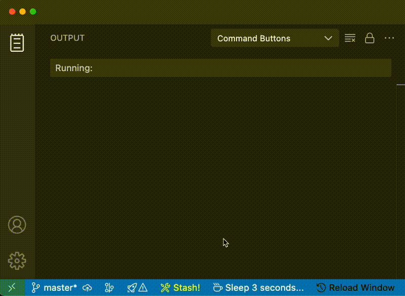

# Command Buttons

> **One-click status bar buttons for your shell commands and VSCode tasks.**

Add customizable buttons to the VS Code status bar that run shell commands or workspace tasks with a single click. See live feedback while commands run — spinning icons, color changes, and output streaming.



---


## Features

- **Shell commands** — run any shell command directly from the status bar
- **VSCode tasks** — trigger tasks defined in `tasks.json`
- **VS Code commands** — execute any Command Palette action (e.g. `editor.action.formatDocument`)
- **Visual feedback** — spinning icon and color change while running
- **Kill on click** — click a running button again to stop it
- **Live reload** — buttons update instantly when you save the config
- **Alias support** — shell commands run in your login shell, so aliases and functions work
- **Per-project config** — each workspace can have its own buttons


## Quick Start

Create `.vscode/command-buttons.json` in your workspace:

```json
{
  "buttons": [
    {
      "id": "build",
      "label": "$(tools) Build",
      "command": "npm run build",
      "tooltip": "Build the project",
      "color": "#4EC9B0"
    }
  ]
}
```

Save the file — the button appears immediately in the status bar (the bar at the bottom that is blue by default). Click the button to run.


## Configuration

Buttons are configured via **`.vscode/command-buttons.json`** in your workspace.


### Full Example

```json
{
  "buttons": [
    {
      "id": "build",
      "label": "$(tools) Build",
      "task": "build",
      "tooltip": "Run the build task",
      "color": "#4EC9B0",
      "runningColor": "#DCDCAA",
      "alignment": "left",
      "priority": 100
    },
    {
      "id": "test",
      "label": "$(beaker) Test",
      "task": "test",
      "tooltip": "Run tests via task",
      "color": "#569CD6",
      "runningColor": "#CE9178"
    },
    {
      "id": "lint",
      "label": "$(checklist) Lint",
      "command": "eslint src --fix",
      "tooltip": "Quick lint with auto-fix",
      "color": "#C586C0"
    },
    {
      "id": "deploy",
      "label": "$(rocket) Deploy",
      "command": "npm run deploy",
      "tooltip": "Deploy to production",
      "color": "#CE9178",
      "runningColor": "#F44747",
      "alignment": "right"
    },
    {
      "id": "docker",
      "label": "$(server) Docker Up",
      "command": "docker compose up -d",
      "tooltip": "Start Docker containers",
      "color": "#569CD6",
      "showOutput": false
    },
    {
      "id": "format",
      "label": "$(wand) Format",
      "vsCommand": "editor.action.formatDocument",
      "tooltip": "Format the current file",
      "color": "#9CDCFE"
    }
  ]
}
```


### Button Properties

| Property | Type | Required | Default | Description |
|----------|------|----------|---------|-------------|
| `id` | `string` | Yes | — | Unique identifier for this button |
| `label` | `string` | Yes | — | Button text (supports `$(icon)` syntax) |
| `command` | `string` | No | — | Shell command to execute |
| `task` | `string` | No | — | VSCode task name from `tasks.json` |
| `vsCommand` | `string` | No | — | VS Code command ID (from Command Palette) |
| `tooltip` | `string` | No | auto | Tooltip shown on hover |
| `color` | `string` | No | — | Text color (e.g. `#4EC9B0`, `yellow`) |
| `runningColor` | `string` | No | — | Text color while running (replaces warning background) |
| `alignment` | `"left"` \| `"right"` | No | `"left"` | Status bar side |
| `priority` | `number` | No | `0` | Position priority (higher = further left) |
| `cwd` | `string` | No | workspace root | Working directory for shell commands |
| `showOutput` | `boolean` | No | `true` | Show output panel for shell commands |

> Each button needs exactly one of `command`, `task`, or `vsCommand`.


### Icons

Icons can be used in button names like this: `$(icon-name)`
The full list of available icons can be found at: [code.visualstudio.com/api/references/icons-in-labels](https://code.visualstudio.com/api/references/icons-in-labels).


## Commands

| Command | Description |
|---------|-------------|
| `Command Buttons: Reload` | Force reload all buttons from config |

Access via the Command Palette (`Cmd+Shift+P` / `Ctrl+Shift+P`).


## How It Works

- **Shell commands** run in your login shell (`$SHELL -ic`) so aliases, functions, and PATH customizations are available.
- **VSCode tasks** are matched by name against tasks defined in `.vscode/tasks.json` and run through VS Code's built-in task system.
- **VS Code commands** execute instantly via `vscode.commands.executeCommand()` — same as picking an action from the Command Palette.
- **Output** from shell commands is streamed to the "Command Buttons" output channel (View > Output > Command Buttons).
- **While running**, the button shows a spinning `$(sync~spin)` icon. If `runningColor` is set, the text changes to that color. Otherwise, the button gets a warning-colored background.
- **Kill processes** Click on running button to kill the shell process.


## License

MIT
